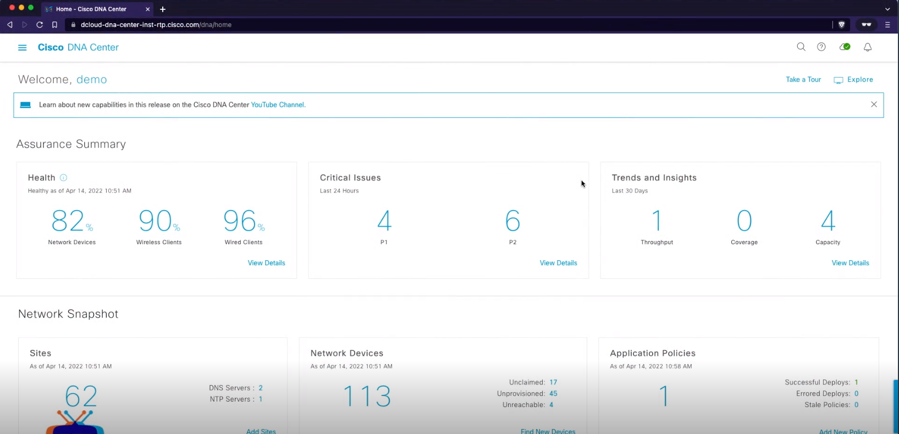
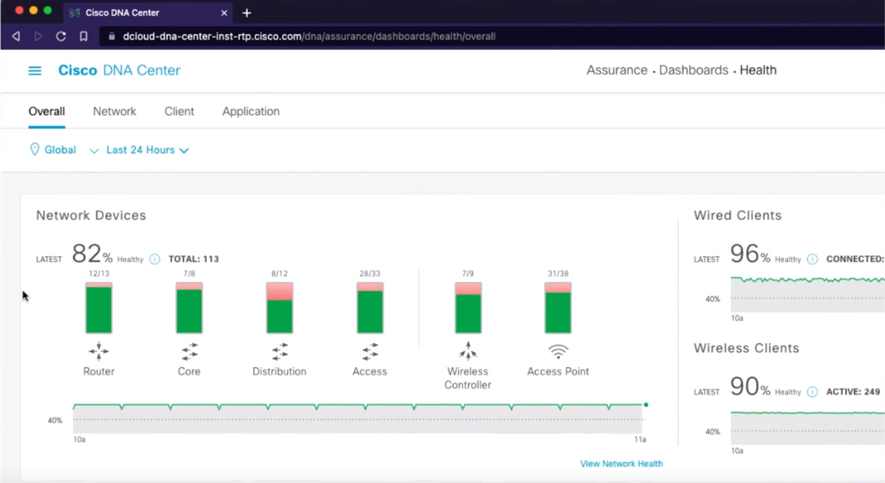
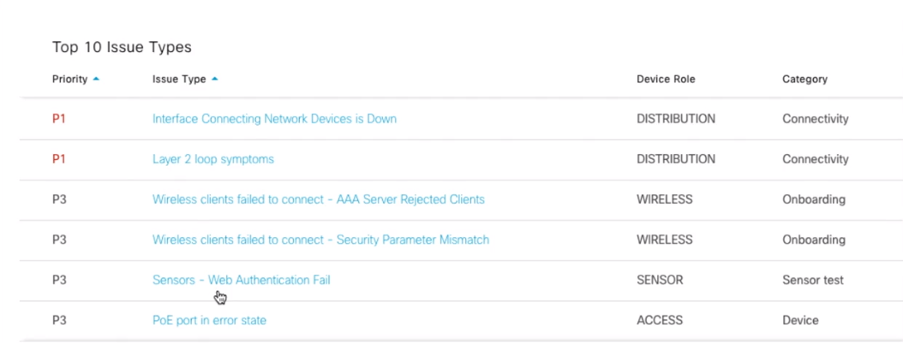
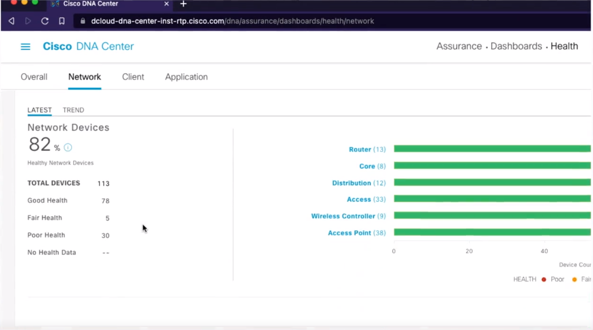

**Cisco DNA Center** is a controller-based architecture solution that provides automation, policy and analytics modification, and the ability to simplify and scale operations[^1]

Health Dashboard

Health Dashboard - Top 10 Issues Types Tracker

Health Dashboard - Networks

## References
[^1]: What is Cisco DNA? [[https://ipwithease.com/what-is-cisco-dna/]]