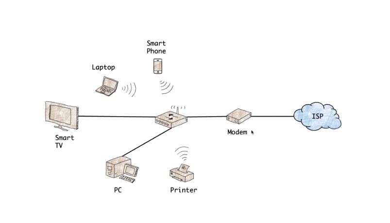
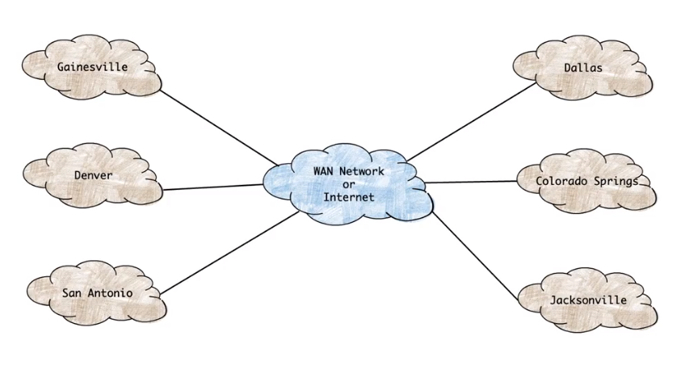
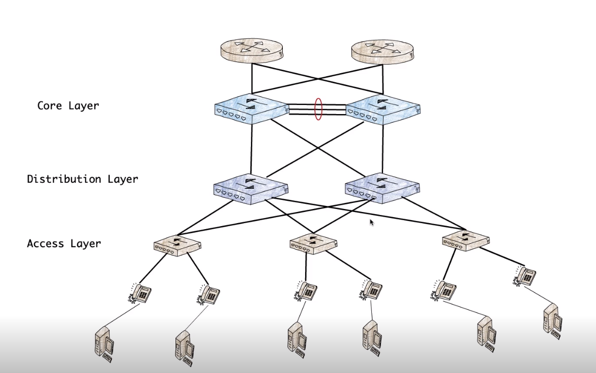
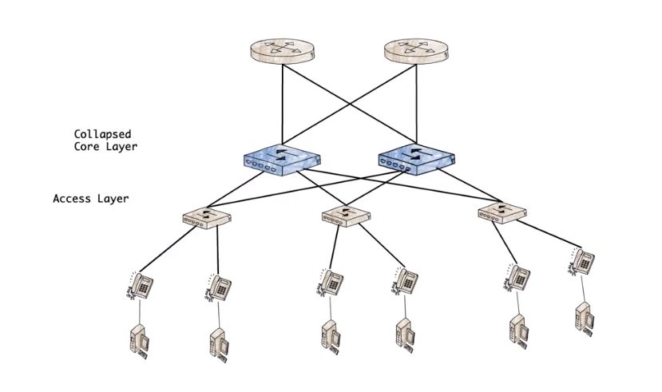
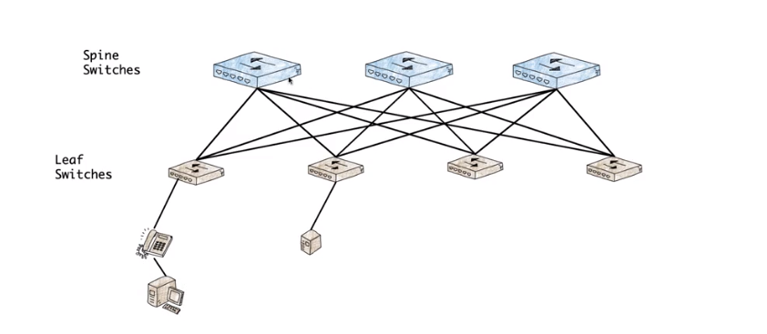
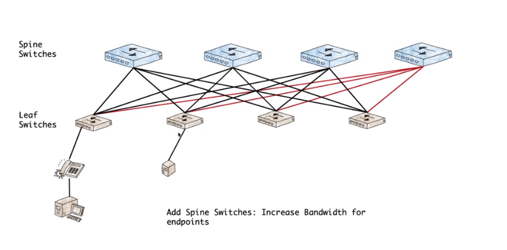
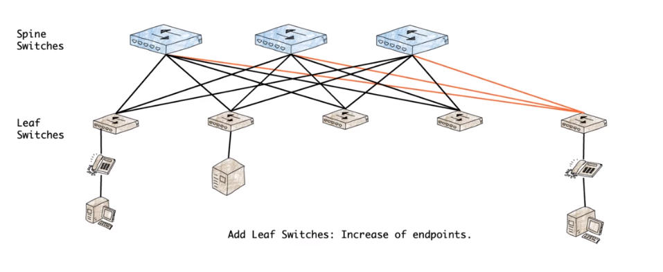
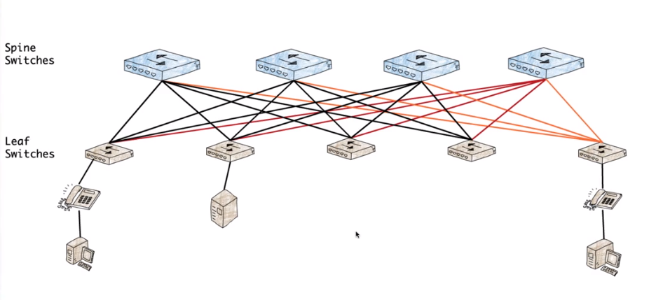

# Network Topologies

**Bus Network** is a legacy network that is connected to a single wire. This network is half-duplex and can send or receive data at one time. Mainly used in wireless networks.[^1]  
**Ring Network** is a legacy network that has devices connected in a circle or *ring*. Data on this network is sent when the device has a token that allows the device to send and receive. This network was costly to setup and maintain.[^1] 
**Star Network** is a network that has every node connected to a central switch and devices can send and receive at the same time on their respective segment.[^1] 

Basic Network Topologies

**Data Collisions** is when 2 devices send at the same time and the data packets collide on the wire. This was more likely to happen on legacy networks like the Bus Network 

**Physical Topology** is how the network devices are actually cabled together

**Logical Topology** is how the network works to send data

Physical Topologies and Logical Topologies **DO NOT** have to match

# Network Types

**Small Office, Home Office (SOHO)** a type of local area network designed for small businesses or individuals who are self-employed[^2]

SOHO example

**Wide Area Network (WAN)** is a large network that is not tied to a single location[^3]

WAN Example

**Hybrid Networks** is a mix of local services and cloud based services

Different types of Responsibilities
- Site, Building, Equipment, Applications, Licensing
- Installing, Administration, Deployment, and Support
- Business Continuity, Disaster Recovery (BCDR)
- Risk Management

# Network Topology Design

Difference between Network Topologies and Network Design Topologies?
- Network Topologies are more descriptive
- Network Design Topologies are more prescriptive

Core - Distribution - Access Topology

Collapsed Core Topology

Spine - Leaf Topology

Expanding Spine

Expanding Leaf

Expanding Spine and Leaf

## References
[^1]: What is a Network Topology [[https://www.dnsstuff.com/what-is-network-topology]]
[^2]: Home Network and SOHO network | computer Networking Part-3 [[https://vid.puffyan.us/watch?v=tFdW9ju1af4]]
[^3]: What is a Wide Area Network [[https://www.comptia.org/content/guides/what-is-a-wide-area-network]]
