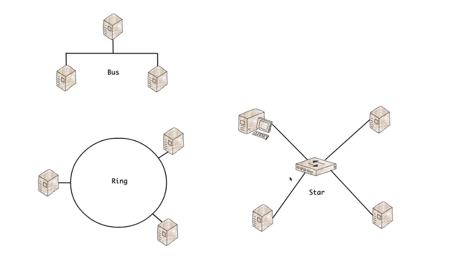

**Bus Network** is a legacy network that is connected to a single wire. This network is half-duplex and can send or receive data at one time. Mainly used in wireless networks.[^1]  
**Ring Network** is a legacy network that has devices connected in a circle or *ring*. Data on this network is sent when the device has a token that allows the device to send and receive. This network was costly to setup and maintain.[^1] 
**Star Network** is a network that has every node connected to a central switch and devices can send and receive at the same time on their respective segment.[^1] 

Basic Network Topologies

**Data Collisions** is when 2 devices send at the same time and the data packets collide on the wire. This was more likely to happen on legacy networks like the Bus Network 

**Physical Topology** is how the network devices are actually cabled together

**Logical Topology** is how the network works to send data

Physical Topologies and Logical Topologies **DO NOT** have to match
## References
[^1] What is a Network Topology [[https://www.dnsstuff.com/what-is-network-topology]]