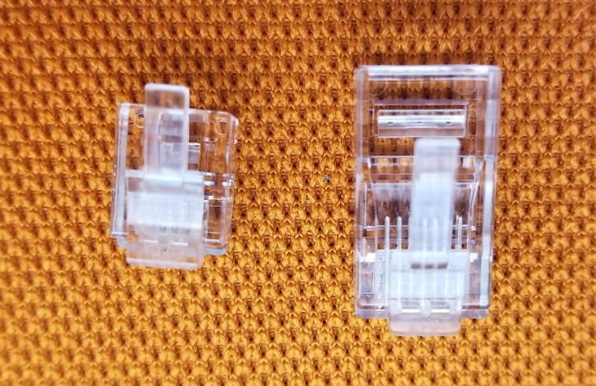
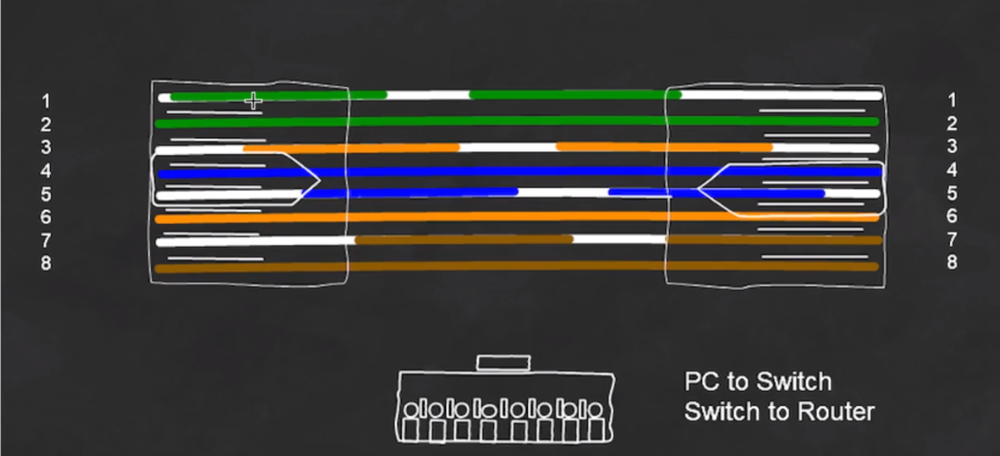
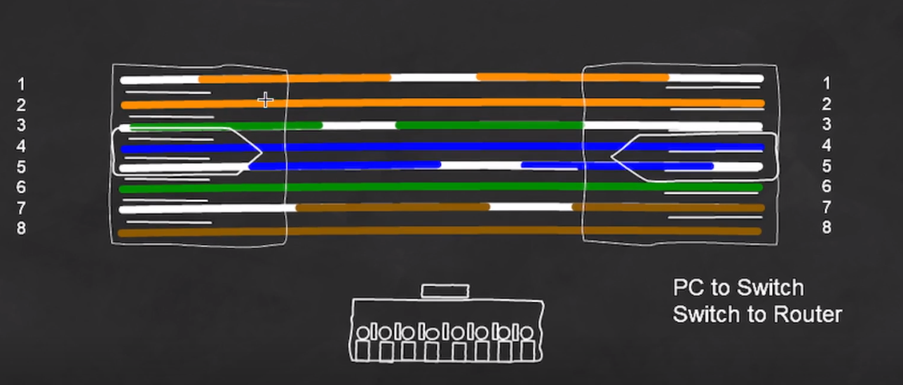
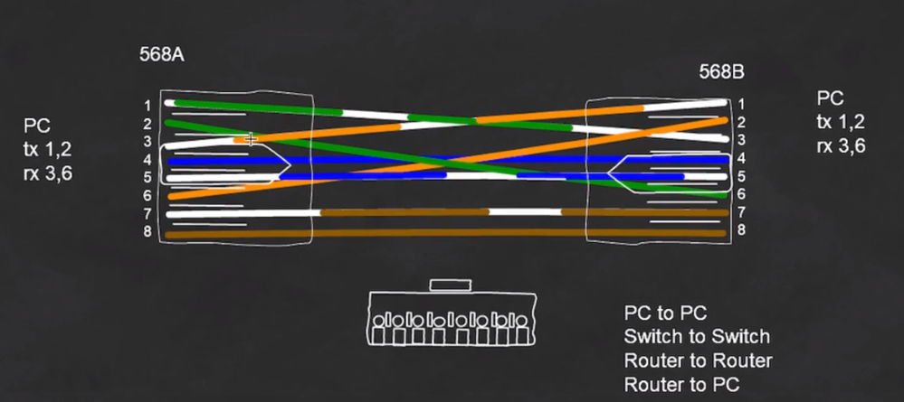
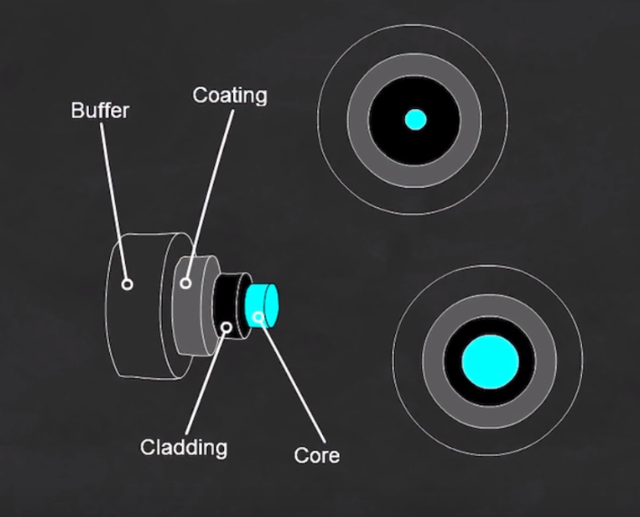
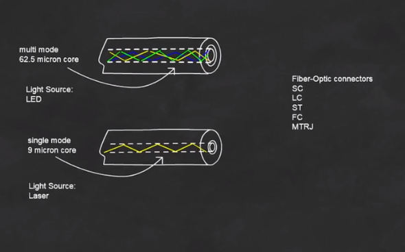
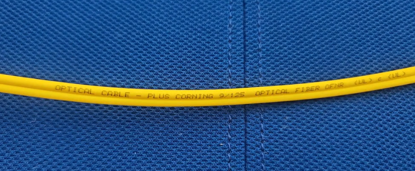
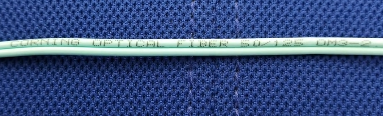
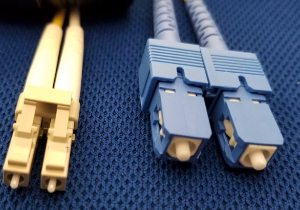
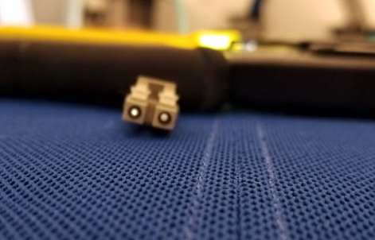

# Physical Cabling

What Category are the cables you are using?
- Cat 5e, Cat 6, Cat 6a, etc

RJ-11 (left) RJ-45 (right) Connectors

568A Straight Through Pin-out

568B Straight Through Pin-out

Cross Over cable

Auto MBIX with fix if the wrong cable is plugged in

Fiber Optic cables

The fiber optic with a smaller core is a single-mode fiber and the fiber optic with a larger core is called a multi-mode fiber

Single mode fiber 

*9/125 = single-mode*

Multi-Mode cable

*50/125 microns = multi-mode*

Fiber Optic Connectors

*Lucent Connector (LC) left, Subscriber Connector (SC) right* [^1]

You can tell a fiber optic is able to send data by shining the connector over the palm of your hand. **DO NOT** look into the connector directly as it can cause permanent damage to your eyes.

**DO NOT** tie fiber optics into a knot or loop them around as it can break the silicon glass inside the cable

## References
[^1]: Types of Fiber Optic Cables and Connectors - Quick Reference [[https://www.meridianoutpost.com/resources/articles/fiber-optic-cables-and-connectors.php]]
