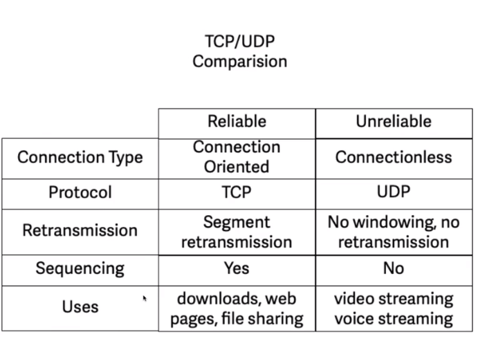
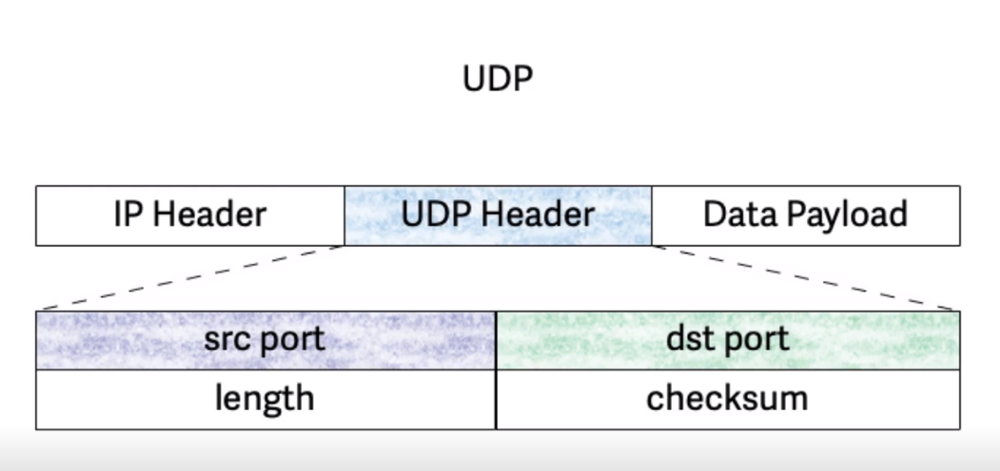
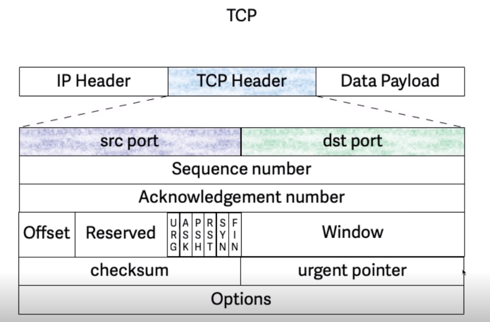
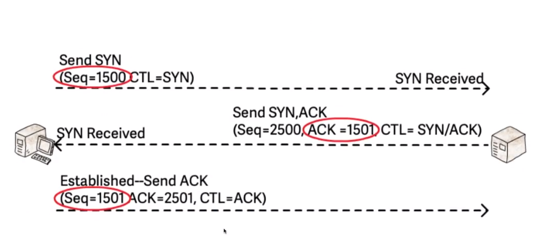
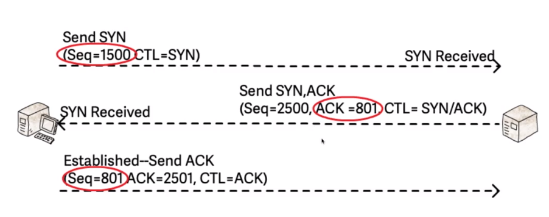

**Transmission Control Protocol (TCP)** is a communications standard that enables application programs and computing devices to exchange messages over a network. It is designed to send packets across the internet and ensure the successful delivery of data and messages over networks [^1]

**User Datagram Protocol (UDP)** is a communications protocol that is primarily used to establish low-latency and loss-tolerating connections between applications on the internet [^2]

UDP Header

TCP Header

TCP Threeway Handshake

TCP Flow Control

Transmission protocol is determined by the application.

## References
[^1]: What is TCP? [[https://www.fortinet.com/resources/cyberglossary/tcp-ip]]
[^2]: User Datagram Protocol (UDP) [[https://www.techtarget.com/searchnetworking/definition/UDP-User-Datagram-Protocol]]