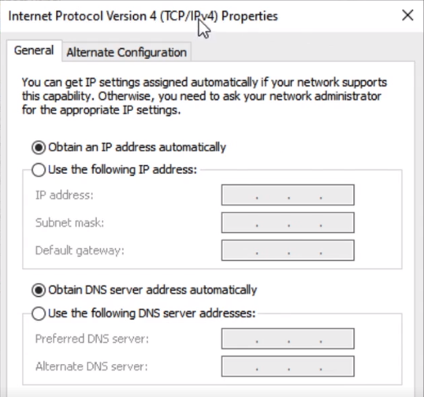

## Reviewing IPv4 Addressing

Dotted decimal notation = 32 bit Binary number

```
192.168.0.1 - IP Address (2 parts - Network ID & Host ID)
255.255.255.0 - Subnet Mask

192.168.0.1/24 - CIDR notation 

-----
IP address:    192      168      0         2
            11000000 10101000 00000000 00000010
Netmask:    11111111 11111111 11111111 00000000
               255      255     255        0
           +--------------------------+--------+
                    Network              Host

```

IPv4 Address Classes
Class A 1.0.0.1 - 127.255.255.254
Default Subnet Mask: 255.0.0.0
Number of Networks: 127
Number of Hosts per Network: 16,777,254
Binary: 00000001

Class B 128.0.0.1 - 191.255.255.254
Default Subnet Mask: 255.255.0.0
Number of Networks: 65, 636 
Number of Hosts per Network: 65, 535 
Binary: 10000000

Class C 192.0.0.1 - 223.255.255.254
Default Subnet Mask: 255.255.255.0
Number of Networks: 16, 777, 216
Number of Hosts per Network: 254
Binary: 11000000

Class D 224.0.0.1 - 255.255.255.254
Default Subnet Mask: N/A
Binary: 11100000

Class E Experimental
Default Subnet Mask: N/A

## Configuring IPv4 on Network Devices

What need IP addresses?
- Endpoints
- Servers
- Workstations
- Routers
- Switches (for Management)

Static IP Microsoft Windows
Settings > Network & Internet > Network and Sharing Center > Change adapter settings > \[Device Type\] > Properties > Internet Protocol Version 4 (TCP/IPv4) > Use the following IP address



IPv4 configuration Cisco Switch/Router
```
Switch>enable
Switch#config terminal
Switch(config)#int vlan 1
Switch(config-if)#ip address 192.168.0.5 255.255.255.0
Switch(config-if)#no shutdown
```


## References
[^1]: Understanding network terminology [[https://wiki.gentoo.org/wiki/Handbook:AMD64/Installation/Networking#Understanding_network_terminology]]
